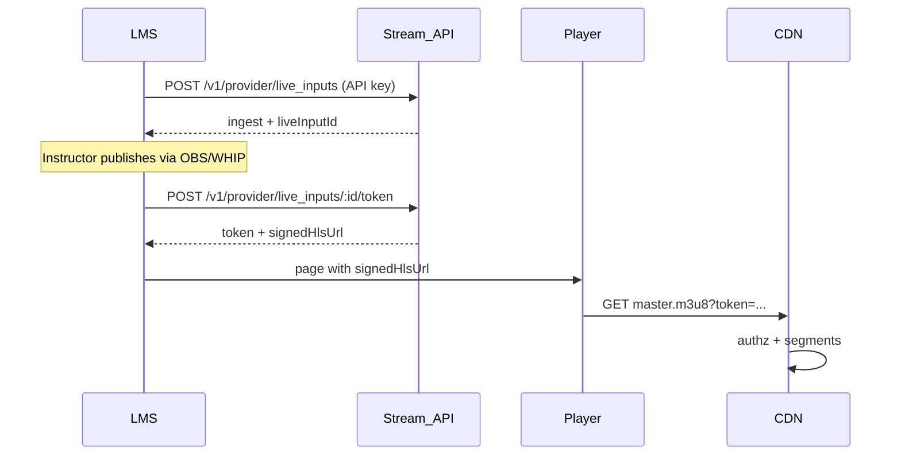

# Embedding the player (LMS and other apps)

Provider playback is **token-gated**. Your backend mints a short-lived JWT with
the API key; the browser never sees the API key.

## Flow



## Mint a token (server-side)

```bash
curl -sS -X POST "$BASE/v1/provider/live_inputs/$ID/token" \
  -H "Authorization: Bearer $STREAM_API_KEY" \
  -H "Content-Type: application/json" \
  -d '{"ttlSeconds":3600}'
```

Response includes `signedHlsUrl` (absolute URL with `?token=`).

## hls.js embed

AES key requests must carry the same token. Use `xhrSetup`:

```html
<video id="video" controls autoplay playsinline></video>
<script type="module">
  import Hls from "https://cdn.jsdelivr.net/npm/hls.js@1/dist/hls.min.js";

  const signedUrl = "https://cdn.example.com/hls/<id>/master.m3u8?token=...";
  const token = new URL(signedUrl).searchParams.get("token");
  const video = document.getElementById("video");

  if (Hls.isSupported()) {
    const hls = new Hls({
      lowLatencyMode: true,
      liveSyncDurationCount: 3,
      xhrSetup(xhr) {
        xhr.setRequestHeader("Authorization", `Bearer ${token}`);
      },
    });
    hls.loadSource(signedUrl);
    hls.attachMedia(video);
  } else if (video.canPlayType("application/vnd.apple.mpegurl")) {
    // Safari: prefer same-origin cookie grants, or a provider domain bounce
    // that sets the `pt` cookie before redirecting to the playlist.
    video.src = signedUrl;
  }
</script>
```

See also [`examples/lms-integration`](../examples/lms-integration/).

## Security notes

- Mint tokens only on your LMS backend after you check enrollment.
- Keep TTLs short (15–60 minutes); revoke by deleting the Redis session (future
  `DELETE .../token` if needed — sessions expire automatically).
- Do not put API keys in the browser.
- This is AES-128 HLS access control, not DRM.
